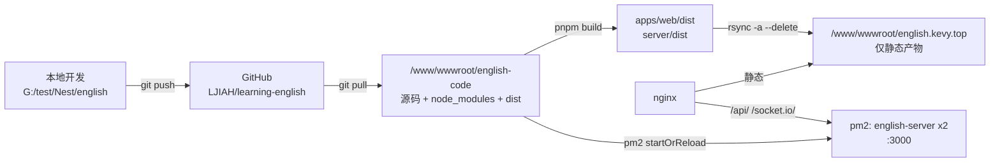

# 部署

一句话：源码在一个独立目录里被 clone 和构建，构建出的静态产物 rsync 到 nginx 的 web 根，后端由 pm2 跑在 3000 端口。

## 文件

- `ecosystem.config.js` — pm2 进程定义（cluster 模式 2 实例，日志合并到 `/root/.pm2/logs`）
- `deploy.sh` — 日常发布 `--deploy` / 回滚 `--rollback`
- `verify.sh` — 发布后自检，只读、不改数据
- `bootstrap.sh` — 首次初始化 + 旧布局迁移，只跑一次

## 目标拓扑



## 为什么要从旧布局迁出来

迁移前，web 根 `/www/wwwroot/english.kevy.top` 里同时放着两类东西：

- 前端产物：`index.html`、`assets/`、`models/`、`favicon.ico`
- 整份仓库根：`server/`、`packages/`、`node_modules/`、`package.json`、`pnpm-lock.yaml`、`pnpm-workspace.yaml`

后果：

- web 根里能直接下载到源码，只能靠 nginx 的「禁止访问敏感文件/目录」规则来兜，属于打补丁而不是隔离
- 服务端 `.env` 就在站点目录下面
- 线上那份代码没有 `.git/`，改了什么、和本地差多少，全靠人工记忆

迁移后：web 根只放静态产物，源码在旁边的代码目录，并且由 git 管理。

## 前置条件

服务器上需要：`git`、`node`、`pnpm`、`pm2`、`rsync`、`curl`。

仓库若是私有的，需要在服务器上配一个只读 deploy key（`bootstrap.sh` 在 clone 失败时会打印步骤）。

## 首次迁移

```bash
scp deploy/bootstrap.sh root@<server>:/root/
ssh root@<server>
bash /root/bootstrap.sh <仓库地址>            # 计划模式：只打印将要执行的操作
bash /root/bootstrap.sh <仓库地址> --yes      # 确认后执行
```

它会按顺序做这些事：

1. 前置检查：工具、旧配置 `WEB_ROOT/server/.env` 是否存在、代码目录是否已存在
2. clone 仓库到 `/www/wwwroot/english-code`
3. 把现网 `server/.env` 复制过去（`chmod 600`），密钥不重新生成
4. `pnpm install --frozen-lockfile`、`prisma generate`，然后依次构建 tracker → web → server
5. 校验产物：后端入口文件存在、前端 bundle 里确实带上了站点地址（防止 `.env.production` 没生效却上线）
6. 停掉旧 pm2 进程（原名 `main`），用 `deploy/ecosystem.config.js` 起新进程 `english-server`，`pm2 save`
7. 把 web 根里的非静态内容整体 `mv` 到 `/www/backup/english-pre-migration-<时间戳>`，再 rsync 前端产物过去
8. 跑 `verify.sh` 自检，并打印剩余的人工步骤

注意第 6 步有秒级停机：新进程要占 3000，必须先释放。

## 日常发布

```bash
ssh root@<server>
cd /www/wwwroot/english-code

bash deploy/deploy.sh --deploy      # 拉代码 + 构建 + 同步前端 + reload + 自检
bash deploy/deploy.sh --rollback    # 回到上一次发布的 commit 并重建
bash deploy/verify.sh               # 只自检
```

`deploy.sh` 的设计要点：

- 工作区必须干净（`git status --porcelain` 为空）才允许拉代码，否则拒绝执行
- 只做 fast-forward（`merge --ff-only`），分叉就报错，不静默产生合并提交
- 每次发布前把当前 commit 记到 `.deploy-state/previous-sha`，供回滚使用
- 构建顺序固定 tracker → web → server（web 依赖 `@en/tracker` 的 dist 产物）
- 同步前端用 `rsync -a --delete`，并排除 `.user.ini` / `.htaccess` / `.well-known/`，避免删掉宝塔和证书校验文件

## 需要人工做的一次性 nginx 清理

迁移完成后，站点配置里那两个「禁止访问敏感文件/敏感目录」的 `location` 块已经没有保护对象了（web 根里不再有源码和 `.env`）。确认没有别的用途后可以删掉，配置文件在：

- `/www/server/panel/vhost/nginx/html_english.kevy.top.conf`
- 同目录的扩展文件：`api.conf`、`spa.conf`、`minio.conf`

改完记得 `nginx -t && nginx -s reload`。

## 已知问题

- **AI 服务没在跑**：nginx 把 `/ai/` 反代到 3001，但 3001 没有进程监听，访问会 502。要么按 `ecosystem.config.js` 里注释掉的示例把服务起起来，要么先摘掉这条代理。
- **tracker 的 DTO 不生效**：`packages/common/tracker/index.ts` 里用的是 TS `interface`，`ValidationPipe` 不会校验，缺字段会一路走到 Prisma 才抛 `PrismaClientValidationError`，对外表现为 500。改成 class + class-validator 装饰器即可。
- **CORS 拒绝来源不再抛异常**：`main.ts` 现在对非白名单来源返回 `callback(null, false)`，请求会继续走到路由（之前是抛 `Error` 被 Nest 兜底成 500）。安全性依赖 `refreshToken` 的 `sameSite=lax`、Bearer access token 和限流，不要再退回抛异常。
- **`server/pnpm-lock.yaml` 是历史遗留**：根目录的 lock 才是准的，服务端单独那份没有被 pnpm 使用，容易误导。

## 约定

- `.env` 一律不入库；`server/.env` 只存在于服务器，靠人工维护（关键项：`DATABASE_URL`、JWT 密钥、`CORS_ORIGIN`）
- `apps/web/.env.production` / `.env.development` **是入库的**：里面只有 `VITE_*` 构建期常量，会被 vite 内联进 bundle，属于公开信息；不提交的话「clone 后构建」会拿不到站点地址，上传、头像、课程图、Socket 全部失效
- 改完 nginx、`.env`、pm2 配置后都要留一份带时间戳的备份，出问题能立刻回退
