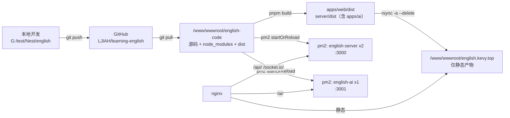

# 部署

一句话：源码在一个独立目录里被 clone 和构建，构建出的静态产物 rsync 到 nginx 的 web 根，两个后端应用由 pm2 分别跑在 3000（english-server）和 3001（english-ai）。

## 文件

- `ecosystem.config.js` — pm2 进程定义（`english-server` cluster 2 实例 + `english-ai` fork 1 实例，日志合并到 `/root/.pm2/logs`）
- `deploy.sh` — 日常发布 `--deploy` / 回滚 `--rollback`
- `verify.sh` — 发布后自检（6 项：端口、接口探针、CORS 白名单、非白名单回归、AI 应用就绪、迁移与仓库一致），只读、不改数据
- `bootstrap.sh` — 首次初始化 + 旧布局迁移，只跑一次（已迁移的机器上重跑会被前置检查拦下，并告知改用 `deploy.sh`）

## 目标拓扑



## 当前生产状态（2026-09-16 实测）

- 服务器 `8.138.193.49`（Alibaba Cloud Linux 3，root，密钥登录）
- 代码 `/www/wwwroot/english-code`，提交 `e71c84d`；web 根 `/www/wwwroot/english.kevy.top` 里只有 `assets/`、`favicon.ico`、`images/`、`index.html`、`.user.ini`
- pm2：`english-server` cluster ×2（:3000）+ `english-ai` fork ×1（:3001）；日志 `/root/.pm2/logs/<名字>-out.log` 与 `<名字>-error.log`
- 依赖服务：PostgreSQL `:5432`、Redis `127.0.0.1:6379`、MinIO `127.0.0.1:9000`
- 版本：node `v24.18.1`、pm2 `7.0.4`、nginx `1.30.4`；pnpm 全局是 `12.4.1`，仓库里因为 `packageManager` 固定为 `pnpm@11.10.0` 会自动切到 11.10.0
- 数据库迁移：`server/prisma/migrations` 下 5 个迁移全部已应用（`prisma migrate status` 通过，即自检第 6 项）
- 最近一次完整发布：`e71c84d`，`deploy.sh` 全流程 + 自检 6/6 通过；公网 `/`、`/ai/v1`、`/api/v1` 均返回 200
- 旧布局备份：`/www/backup/english-pre-migration-20260916172111`（web 根里原有的 `server/`、`packages/`、`node_modules/` 等都在里面）

## 为什么要从旧布局迁出来

迁移前，web 根 `/www/wwwroot/english.kevy.top` 里同时放着两类东西：

- 前端产物：`index.html`、`assets/`、`models/`、`favicon.ico`
- 整份仓库根：`server/`、`packages/`、`node_modules/`、`package.json`、`pnpm-lock.yaml`、`pnpm-workspace.yaml`

后果：

- web 根里能直接下载到源码，只能靠 nginx 的「禁止访问敏感文件/目录」规则来兜，属于打补丁而不是隔离
- 服务端 `.env` 就在站点目录下面
- 线上那份代码没有 `.git/`，改了什么、和本地差多少，全靠人工记忆

迁移后：web 根只放静态产物，源码在旁边的代码目录，并且由 git 管理。

## 前置条件

服务器上需要：`git`、`node`、`pnpm`、`pm2`、`rsync`、`curl`。

仓库若是私有的，需要在服务器上配一个只读 deploy key（`bootstrap.sh` 在 clone 失败时会打印步骤）。

## 首次迁移

```bash
scp deploy/bootstrap.sh root@<server>:/root/
ssh root@<server>
bash /root/bootstrap.sh <仓库地址>            # 计划模式：只打印将要执行的操作
bash /root/bootstrap.sh <仓库地址> --yes      # 确认后执行
```

它会按顺序做这些事：

1. 前置检查：工具、旧配置 `WEB_ROOT/server/.env` 是否存在、代码目录是否已存在（如果发现是已迁移过的机器，这里就会直接拒绝并指向 `deploy.sh`）
2. clone 仓库到 `/www/wwwroot/english-code`
3. 把现网 `server/.env` 复制过去（`chmod 600`），密钥不重新生成
4. `pnpm install --frozen-lockfile`、`prisma generate`、`prisma migrate deploy`，然后依次构建 tracker → web → server → ai
5. 校验产物：后端入口文件存在、前端 bundle 里确实带上了站点地址（防止 `.env.production` 没生效却上线）
6. 停掉旧 pm2 进程（原名 `main`），用 `deploy/ecosystem.config.js` 起新进程 `english-server` 和 `english-ai`，`pm2 save`
7. 把 web 根里的非静态内容整体 `mv` 到 `/www/backup/english-pre-migration-<时间戳>`，再 rsync 前端产物过去
8. 跑 `verify.sh` 自检，并打印剩余的人工步骤

注意第 6 步有秒级停机：新进程要占 3000，必须先释放。

## 日常发布

```bash
ssh root@<server>
cd /www/wwwroot/english-code

bash deploy/deploy.sh --deploy      # 拉代码 + 构建 + 同步前端 + reload + 自检
bash deploy/deploy.sh --rollback    # 回到上一次发布的 commit 并重建
bash deploy/verify.sh               # 只自检
```

`deploy.sh` 的设计要点：

- 工作区必须干净（`git status --porcelain` 为空）才允许拉代码，否则拒绝执行；唯一例外是脚本自己的 `.deploy-state/`（已写进 `.gitignore`，且检查时会再过滤一次）
- 只做 fast-forward（`merge --ff-only`），分叉就报错，不静默产生合并提交
- 每次发布前把当前 commit 记到 `.deploy-state/previous-sha`，供回滚使用
- 构建顺序固定 tracker → web → server → ai（web 依赖 `@en/tracker` 的 dist 产物；`server` 与 `ai` 是同一个 nest 项目下的两个应用，互不覆盖对方的 dist）
- 迁移排在**产物校验之后、同步前端和重载之前**（`migrate_db`）：构建或校验失败时数据库和线上都没被动过；迁移失败立刻退出，此时前端还没同步，不会出现「新前端 + 旧后端」这种最难查的组合。没有新迁移时它是 no-op
- `pm2 startOrReload` 不带 `--only`，`ecosystem.config.js` 里的所有进程（`english-server`、`english-ai`）由同一次发布统一接管，不存在需要手动启动的进程
- `--rollback` 只回滚代码，**不回滚数据库**：`prisma migrate deploy` 只向前应用迁移，没有自动反向迁移。回滚前要确认那次发布没有带不可逆的 schema 变更；库与当前代码不一致时 `verify.sh` 的第 6 项会报出来
- 同步前端用 `rsync -a --delete`，并排除 `.user.ini` / `.htaccess` / `.well-known/`，避免删掉宝塔和证书校验文件

## nginx 配置（现状）

站点配置 `/www/server/panel/vhost/nginx/html_english.kevy.top.conf`：

- `root /www/wwwroot/english.kevy.top`，`index index.html`；通配 include 扩展目录 `extension/english.kevy.top/*.conf`
- HTTP 跳 HTTPS、HTTP/3（`listen 443 quic`）、HSTS、图片 30d / js|css 12h 缓存；日志在 `/www/wwwlogs/english.kevy.top.log` 与 `.error.log`
- 保留 `.well-known` 相关规则：用于证书申请验证，并禁止在验证目录里放敏感后缀文件 —— 这条与旧布局无关，不要删
- 迁移前那两个「禁止访问敏感文件/敏感目录」的 `location` 块**已经删除**（web 根里不再有源码和 `.env`，没有保护对象）；伪静态文件 `/www/server/panel/vhost/rewrite/html_english.kevy.top.conf` 里只有一段占位注释，路由回退由 `spa.conf` 负责

扩展目录 `extension/english.kevy.top/` 下三个文件：

- `api.conf` — `/api/`、`/socket.io/` 反代到 3000，`/ai/` 反代到 3001（也在本文件里，没有单独的 ai.conf）。socket.io 需要 `Upgrade`/`Connection` 头，AI 需要 `proxy_buffering off`，两者都要 600s 超时
- `minio.conf` — `/course/`、`/avatar/` 反代到 9000，让浏览器同源取图；必须用 `^~`，否则会被主配置里的图片正则 location 抢走并返回 404
- `spa.conf` — `try_files $uri $uri/ /index.html`，前端路由刷新不 404

改完一律 `nginx -t && nginx -s reload`，并留一份带时间戳的备份。

## AI 服务（english-ai）

`server/apps/ai` 与 `server/apps/server` 是同一个 nest 项目（`server/nest-cli.json`）下的两个应用，分别监听 3001 / 3000，由 `ecosystem.config.js` 一起交给 pm2 管理，日常发布走同一个 `deploy.sh`。

- 构建：`pnpm --filter @en/server run build:ai`，产物 `server/dist/apps/ai/apps/ai/src/main.js`（`deploy.sh` / `bootstrap.sh` 已包含）
- 路由：`main.ts` 里 `setGlobalPrefix("ai")` + URI versioning，所以对外是 `/ai/v1/...`；启动日志里实测到的路由是 `POST /ai/v1/chat`、`GET /ai/v1/chat/history`、`GET /ai/v1/prompt/list`，前端在 `apps/web/src/apis/sse/index.ts` 里请求 `/ai/v1/chat`
- nginx：`extension/english.kevy.top/api.conf` 里 `location ^~ /ai/` 反代到 3001，`proxy_buffering off` + 600s 超时（SSE 必需，否则前端要等整段生成完才收到）
- 自检：`verify.sh` 第 5 项检查 3001 在监听且 `GET /ai/v1` 返回 200（该请求能过说明 Nest 与 `AI_DATABASE_URL` 都通）
- 启动即初始化：`ChatService.onModuleInit` 会用 `AI_DATABASE_URL` 跑 `PostgresSaver.setup()` 建 langgraph 检查点表，所以起不来的第一现场是 `pm2 logs english-ai`
- **副作用**：`DigestService.onModuleInit` 会注册一个每天 00:00 的 BullMQ repeatable job，给「开了定时任务 + 留了邮箱 + 当天背过单词」的用户跑 LLM 生成单词报告并真实发信（费用 + 真发信）。要长期停掉发信，得改代码把 `DigestModule` 从 `AiModule` 摘掉；`pm2 stop english-ai` 只能撑到下一次发布

## 故障排查

- **「工作区有未提交改动，拒绝发布」**：先 `cd /www/wwwroot/english-code && git status --short` 看是哪几行。这条检查的本意是拦住「有人直接改服务器上的源码」，处置方式是 `git checkout -- <file>` 还原（确实要保留就先提交到 git）。脚本自己的 `.deploy-state/` 已排除，不该出现在这里。
- **自检第 5 项 FAIL（3001 或 `/ai/v1` 不通）**：先看 `pm2 logs english-ai`。最常见的是 `AI_DATABASE_URL` 连不上（`ChatService.onModuleInit` 启动时会跑 `PostgresSaver.setup()` 建检查点表），其次是 `server/.env` 里缺 `DEEPSEEK_API_KEY`。
- **自检第 6 项 FAIL（迁移与仓库不一致）**：`pnpm --filter @en/server exec prisma migrate status` 会列出未应用的迁移。刚做过 `--rollback` 时「库比代码新」属于预期内，要么把代码发回去，要么补一次向前的手工迁移。
- **发布后接口 502 或 EADDRINUSE**：旧进程 `main` 还在占 3000。`pm2 describe main`，然后 `pm2 delete main && pm2 save`（`deploy.sh` 的前置检查也会拦这一种，并在报错里给出这条命令）。
- **前端图片/头像/课程图/Socket 全挂**：`apps/web/.env.production` 没被加载，`VITE_*` 没内联进 bundle。`assert_artifacts` 会用「产物里必须出现站点域名」把这种情况判死（`grep -rl english.kevy.top apps/web/dist/assets` 可以人工复核）。
- **AI 发布成功但跑的是旧代码**：`dist/apps/ai` 没被重建。现在 `assert_artifacts` 会断言 AI 入口存在，但构建日志里仍要看到「构建 @en/ai」这一行。
- **error log 里的 `[CORS] 已拒绝来源: https://not-in-whitelist.example.com`**：`verify.sh` 第 4 项故意用非白名单来源探了一次，属于预期输出，不是故障。
- **日志在哪**：应用用 `pm2 logs english-server` / `pm2 logs english-ai`，文件在 `/root/.pm2/logs/<名字>-{out,error}.log`；nginx 在 `/www/wwwlogs/english.kevy.top.log` 与 `.error.log`。old 进程留下的 `main-out.log` / `main-error.log` 已无人写入，可以直接删。

## 已知问题

- **tracker 的 DTO 不生效**：`packages/common/tracker/index.ts` 里用的是 TS `interface`，`ValidationPipe` 不会校验，缺字段会一路走到 Prisma 才抛 `PrismaClientValidationError`，对外表现为 500。改成 class + class-validator 装饰器即可。
- **CORS 拒绝来源不再抛异常**：`main.ts` 现在对非白名单来源返回 `callback(null, false)`，请求会继续走到路由（之前是抛 `Error` 被 Nest 兜底成 500）。安全性依赖 `refreshToken` 的 `sameSite=lax`、Bearer access token 和限流，不要再退回抛异常。
- **`server/pnpm-lock.yaml` 是历史遗留**：根目录的 lock 才是准的，服务端单独那份没有被 pnpm 使用，容易误导。
- **`marked@18` 依赖 Node 的 `require(esm)`**：它解析到的是 `marked.esm.js`，在 Node ≥ 22（服务器是 24.18.1）上正常，降到 Node 20 会在启动时直接报错。
- **仓库 pre-commit 钩子会跑 `npx prettier`**：本地没装 prettier 时会打印 `'prettier' is not recognized`，只是噪音，不阻塞提交。

## 约定

- `.env` 一律不入库；`server/.env` 只存在于服务器，靠人工维护（关键项：`DATABASE_URL`、JWT 密钥、`CORS_ORIGIN`）
- `apps/web/.env.production` / `.env.development` **是入库的**：里面只有 `VITE_*` 构建期常量，会被 vite 内联进 bundle，属于公开信息；不提交的话「clone 后构建」会拿不到站点地址，上传、头像、课程图、Socket 全部失效
- 改完 nginx、`.env`、pm2 配置后都要留一份带时间戳的备份，出问题能立刻回退
